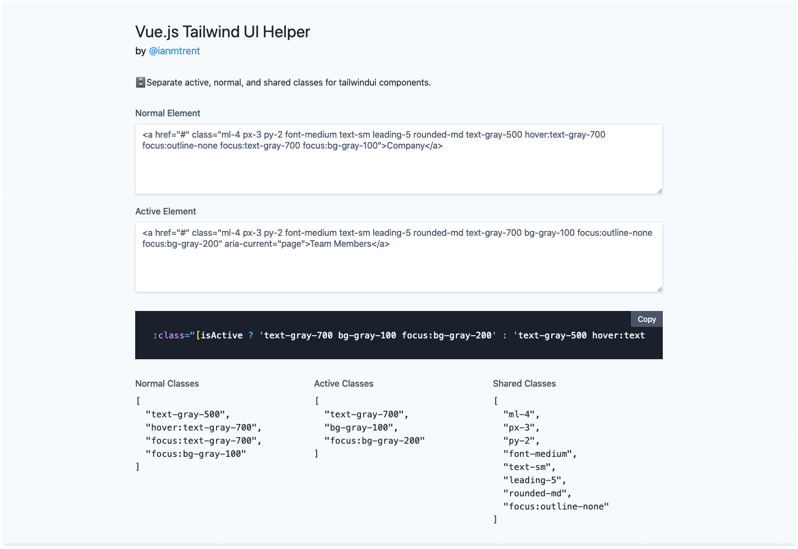

## 🗄 Vue.js Tailwind UI Helper

Separate normal, active, and shared classes for Tailwind UI components.



### 👨🏻‍💻 Development

```bash
$ git clone https://github.com/imtrent/vue-tailwindui-helper.git
$ npm install
$ npm start
```

This will serve the files at `http://localhost:3000/`
